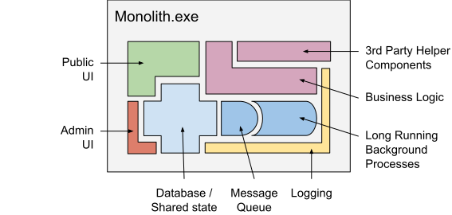
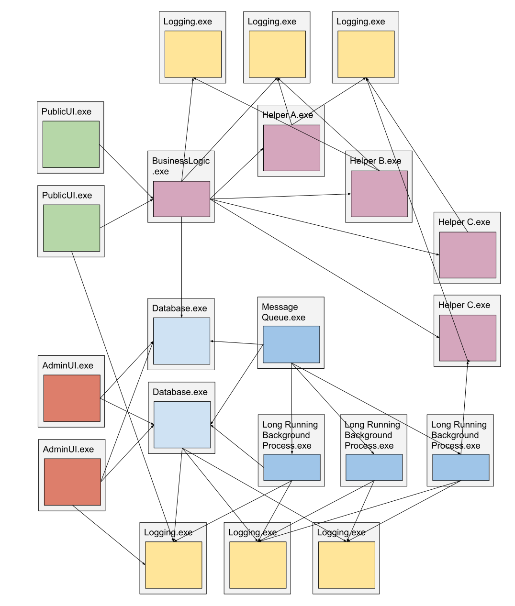
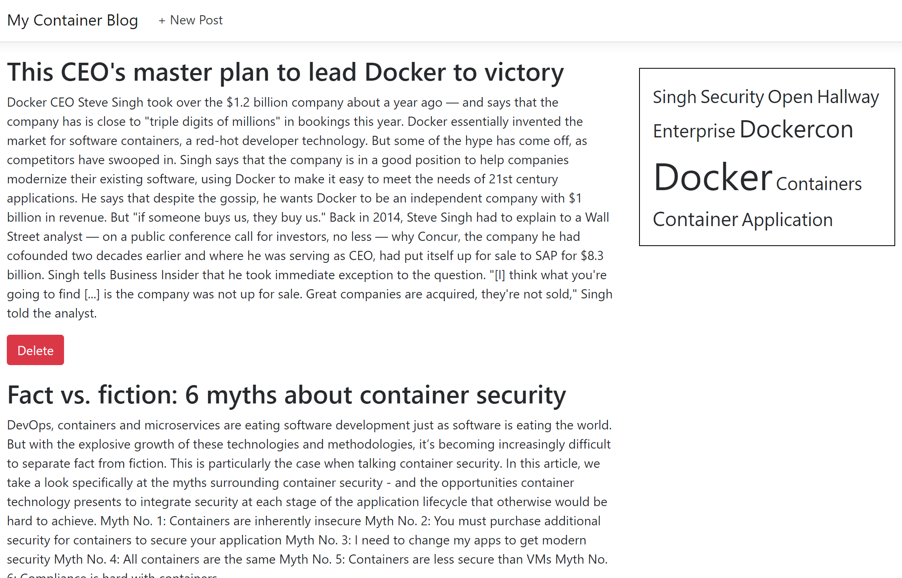
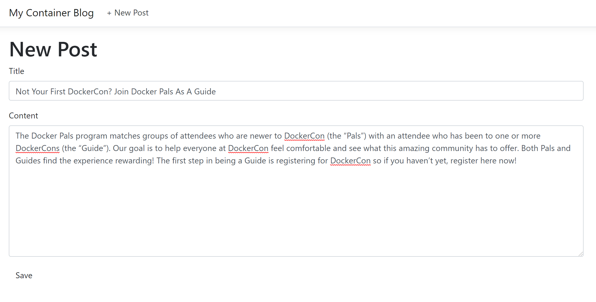
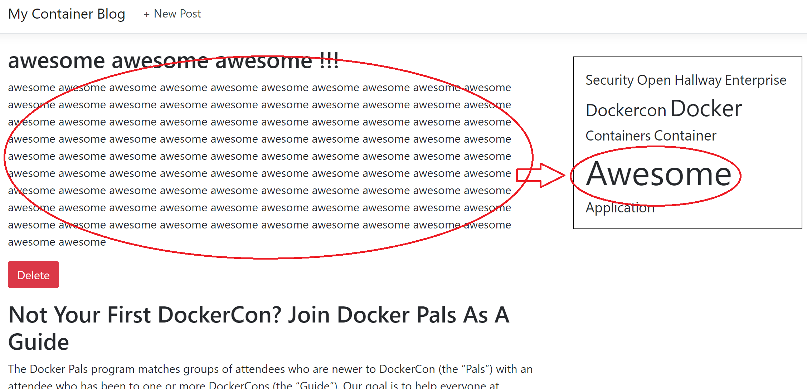

# Migrate a Monolith application into a set of Microservices

By the end of this exercise, you are able to:

 - Understand the pros and cons of microservices vs monoliths
 - Identify components and interfaces to define individual microservices
 - Break a monilith into microservices
 - Plan next steps around test coverage and scalability

## Microservices vs Monoliths

A monolithic architecture means that your app is written as one cohesive unit of code whose components are designed to work together, sharing the same memory space and resources.

A microservice architecture means that your app is made up of lots of smaller, independent applications capable of running in their own memory space and scaling independently from each other across potentially many separate machines.

### Monoliths

The following example illustrates a possible architecture of a monolith application: 

Many apps have lots of shared state and a larger number of cross-cutting concerns, such as logging, rate limiting, login, audit trails, etc.

Since components are running in the same process space, they tend to get tightly coupled.

Pros:

1. Connecting components easily

    No need to think "too complex". Simply let every component access the shared state or call other component's functions.

2. Increased per-Host performance

    Since shared-memory access is faster then communication across processes or even hosts, there is a performance advantage. But that's limited to the resources available on the given single host.

Cons:

1. Nearly impossible to scale horizontally

    Horizontal scaling is ability to run and sometimes even connect multiple software entitites (in this case Docker Containers/Pods) so that they work as a single logical unit. In some cases these entities run on the same host and at some scale, they run a different hosts.
    
    However monoliths run everything in a single process and simply running that process multiple times in parallel introduces a couple of problems:

    - In-Process state/memory not shared with other processes
    - No way to only scale parts / specific components of the monolith
    - By design, components are not aware of other component instances

2. Harder to understand / difficult to maintain

    Tightly coupleing components makes it harder to understand the relationship and dependencies between components, ownership of objects/memory, side-effects and individual workflows like who is triggering what etc.

3. Harder to implement unit tests

    Tightly coupleing components often introduces problems when trying to create unit test to actually isolate and test only particular components.

## Microservices

The following example illustrates a possible architecture of a microservices application: 

Microservice architectures are typically better organized, since each microservice has a very specific job, and is not concerned with the jobs of other components.

Pros:

1. Ideal for horizontal scaling / increasing total performance 

    Since individual services are not concerned with other services they can be scales independently. By design, a single service instance can run in parallel to other service instances.

    Depending on the service / use case, that allows increasing the total service performance.

2. Easier (re-)composing of services

    Since services are decouples from each other and the communication protocol/interface can be defined independently of the actualy service implementation, it's easy to reconfigure the set of services and even replace services with different interface implementations.

3. Easier maintaining of services

    Since services are decouples from each other, a single service can be maintained independently, without worrying about other services. That also makes reduces the complexity of all services.

5. More flexible testing

    Since services are decouples from each other, it's possible create tests that provide 'fake' or test-implementations of dependent services.

Cons:

1. Initial cost to design the architecture

2. Performance overhead caused by inter-service communication

    Examples:

    - Routing all traffic thought an extra service layer
    - Encapsulating common functionality into a dedicates services used by many other services
    - Breaking things into multiple services, just to reduce the complexity of each single service and *not* because it's consumed my multiple different services.

3. Debugging distributed systems may get hard

4. Requires additional tooling to automate deployment (but for that we have Docker Enterprise)

## Example Monolithic Application

The folder 'applications/monolith' contains of an monolith application and a compose file to build run the application. Try it out:

~~~~
cd application/monolith
docker build -t monolith .
docker stack deploy docker-compose.yml
~~~~

After startup, connect to the application at http://localhost:8080/ and you will get a blog page like this:

On the left side, you see the main contant: A list of the recent blog posts (title + content). On the upper right corner, there is a tag cloud showing the most used/relevant words from all the blog posts.

There is also a 'New Post' page (see link at the very top) to actually add a new blog post:

So every time a new blog post is created (or an existing one is deleted), the tag cloud of most used/relevant words gets updated. In production, the process of updating the tag cloud may take some time (in this example, this is slowed down to 3 seconds).

After posting another "awesome" blog post, see how this affects the tag cloud:

## What are good candidates of components to be migrated into microservices?

Let's assume the number of blog posts increases over time. The more blog posts there are, the longer it takes to calculate the tag cloud. At some point it's not possible to do this in reasonable amount of time using the resources available. That's why the middleware is actually a very good candidate for running as a dedicated microservice. Because then it could be scaled out independently, so it doesn't impact other components.

Let's assume the number of blog visits massivly increases over night. To deal with situations like that, the frondend-tier needs to be scaled out. But that should not impact other components, as this is all about rendering and sending web pages clients. So it's an ideal candidate for a dedicated microservice.

Let's assume the number of blog posts (including media objects, etc.) exeeds what a single database instance can handle, then there needs to be some kind of scaling on the database tier. In case there are HA or data replication requirements due to legal laws, this would also affect how data is stored. That's why this needs to be handles separately, independend of the other application components.

So the following application components should be refactored/extracted out of the monolith into a set of microservices:

- Frontend website (currently using ASP.NET Core Razor Pages)
- Middleware for generating the tag cloud (currently caching word cloud in-memory)
- Database for actually storing blog posts (currently, SQLite)

## Solution

The folder 'applications/microservices' contains a couple of microservice applications and a compose file to build run them:

~~~~
cd application/microservices/backend
docker build -t backend .

cd application/microservices/frontend
docker build -t frontend .

cd application/microservices/middleware
docker build -t middleware .

cd application/microservices
docker stack deploy docker-compose.yml
~~~~

Everything still works, just like with the monolith architecture. However, now the frontend service as well as the middleware service can be scaled horizontally. Scaling the database tier requires more work, as the database technology used (SQLite) doesn't support scaling. But conceptionally, it's now possible to scale the individual service tiers independently.